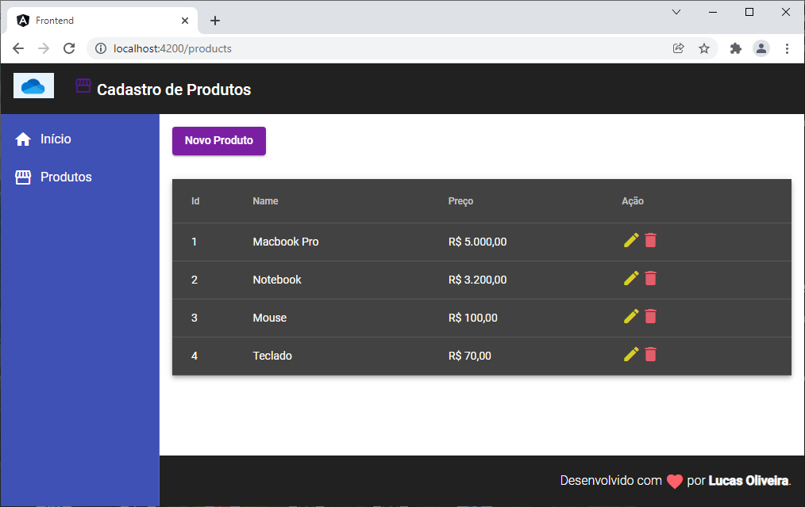

# Loja-Angular
To run it, you must have Node.JS, NPM and Angular installed on your machine.

With the above programs installed, run the command below in the "frontend" folder and also in the "backend" folder:

`npm install`

With the dependencies installed, start running the backend and the front end server with the command in the two folders (in separate tabs in terminal):

`npm start`

Ready, the backend and frontend application will be running as follows:

You will be able to add products, list all of them, delete and edit.
